# Grievance Recognition System Based on Text/Speech

## Introduction
This project develops an innovative Grievance Recognition System that utilizes advanced NLP and machine learning techniques to automate the processing of grievances via text and speech inputs. Aimed at improving efficiency in handling user grievances, the system is a part of our Major Project submission, Department of Electronics and Computer Engineering, Pulchowk Campus, Tribhuvan University.

## Project Team
- Ashwini Mandal
- Mahima Dhakal
- Nadika Poudel
- Aashish Kumar Sah

## Supervisor
- Dr. Basanta Joshi, Assistant Professor, Department of Electronics and Computer Engineering, Pulchowk Campus

## System Overview
The system is structured into three core components:
1. **Automatic Speech Recognition (ASR)**: Utilizes the state-of-the-art wav2vec 2.0 model, fine-tuned for the Nepali language, to convert speech into text.
2. **Text Classification**: Employs both traditional machine learning models and deep learning approaches including LSTM, BiLSTM, and transformer-based models like NepaliBERT and MuRIL for efficient classification of the grievances.
3. **Web Interface**: A user-friendly web interface that facilitates easy submission and tracking of grievances.

## Setup and Installation
Detailed instructions on how to set up and run the project locally.

### Requirements
  `requirements.txt `

### Installation Steps
1. Clone the repository 
2. Install Python dependencies
3. Setup Database
4. Run the backend server : port
5. Access the web interface at `http://localhost:port`.

# Technical Description:

## Project Overview
The Grievance Recognition System is designed to automate the handling of grievances received in text or speech formats using advanced machine learning and natural language processing techniques. This system is especially tuned to understand and process inputs in the Nepali language, accommodating the linguistic nuances essential for effective grievance handling.

## System Architecture

### Components
The system comprises three major components:
1. **Automatic Speech Recognition (ASR)**
2. **Text Classification**
3. **Web Interface**

### Automatic Speech Recognition (ASR)
- **Model**: wav2vec 2.0, fine-tuned for Nepali language.
- **Purpose**: Converts speech input into text. It allows users to submit their grievances orally, making the system accessible to a broader user base, including those unable to write.
- **Process**:
  - The speech audio is captured and processed using a feature extractor.
  - The processed features are then fed into the wav2vec 2.0 model to generate the corresponding text output.
- **Try our ASR model**
  - [Try ASR model here](https://huggingface.co/Ashwini1412/wav2vec2-nepali-final?)

### Text Classification
- **Models Used**:
  - Traditional ML models: SVM, Decision Trees.
  - Deep Learning models: LSTM, BiLSTM.
  - Transformer models: NepaliBERT, MuRIL.
- **Purpose**: Classifies the text into categories such as complaints, queries, and suggestions, which can then be routed to the appropriate departments.
- **Process**:
  - Text input is tokenized and vectorized.
  - The vectorized text is processed through the model to classify into predefined categories.
- **Try our fine-tuned models**:
- [Nepali-bert fine-tuned for text classification ](https://huggingface.co/nadika/nepali_complaints_classification_nepbert3)
- [Muril fine-tuned for text classification](https://huggingface.co/nadika/nepali_complaints_classification_muril3)

### Web Interface
- **Technologies**: Django
- **Features**:
  - Users can submit grievances through a text form or voice recording.
  - Dashboard for tracking the status of submitted grievances.
  - Admin panel for response management and analytics.
  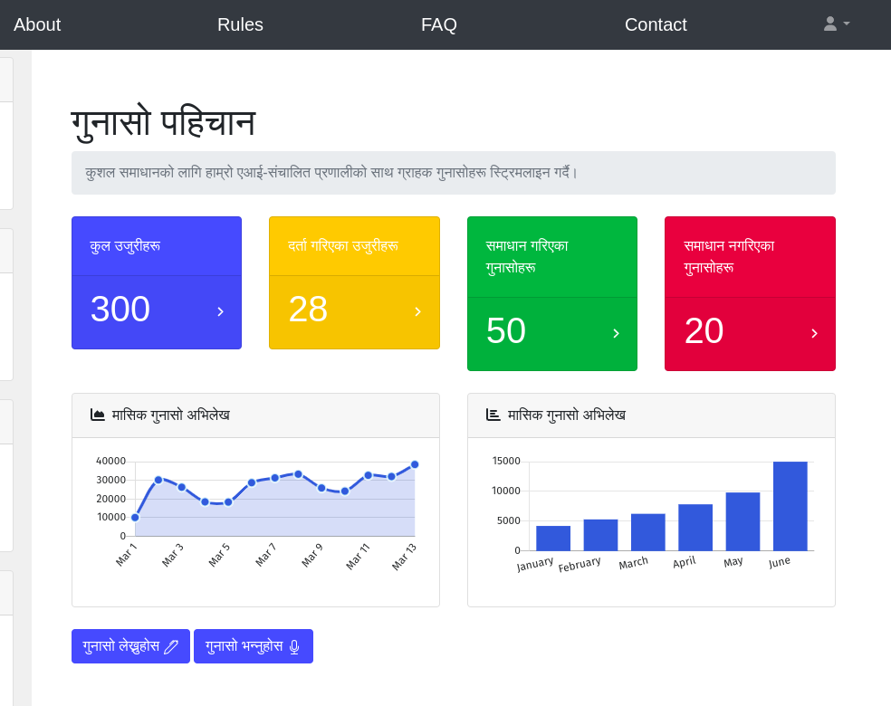
  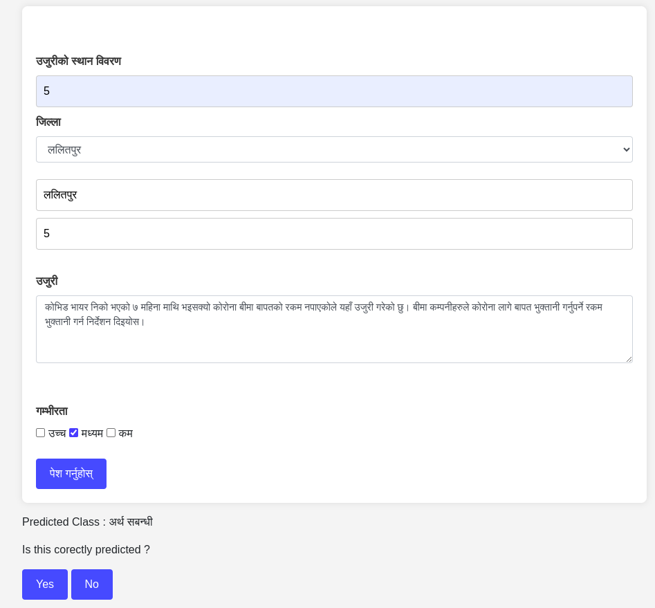
   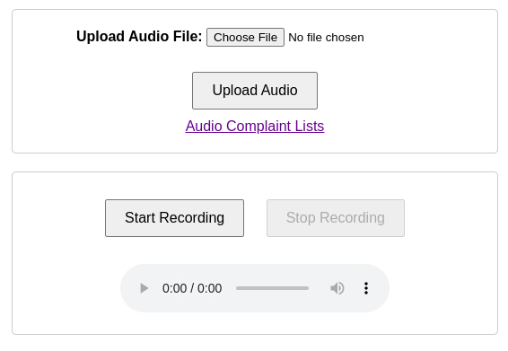
    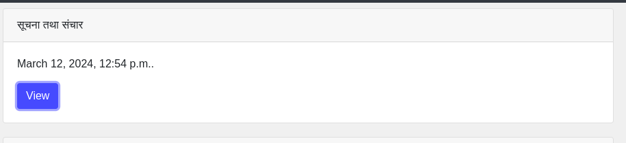

## Data Flow
1. **Input Acquisition**: Users submit their grievances via the web interface using either text or speech.
2. **Preprocessing**:
   - **Speech to Text**: Audio inputs are converted to text using the ASR component.
   - **Text Normalization**: Text inputs are cleaned and normalized for processing.
3. **Classification**: The preprocessed text is then classified into categories using the text classification models.
4. **Response Generation**: Based on the classification, automated responses or routing decisions are made.
5. **Output Delivery**: Responses or status updates are communicated back to the user through the web interface.

## Technologies
- **Backend**: Python, Django, PyTorch, Hugging Face Transformers.
  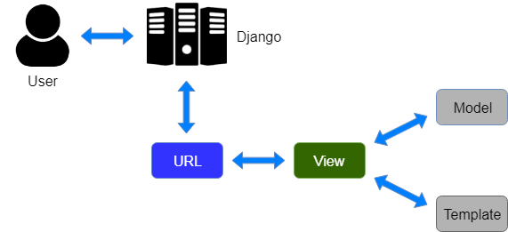
- **Frontend**: HTML-CSS, Bootstrap.
- **Database**: MySQL.
- **Machine Learning/Deep Learning**: scikit-learn, TensorFlow, PyTorch.
- **Speech Processing**: Librosa, Hugging Face Transformers.

## System Design
  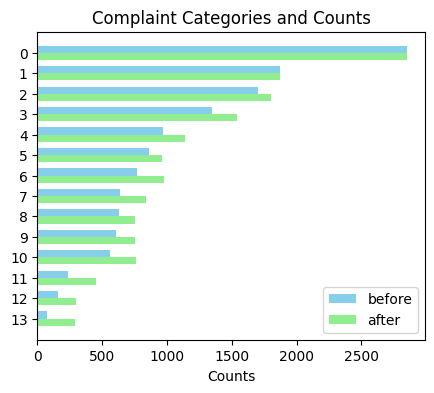
   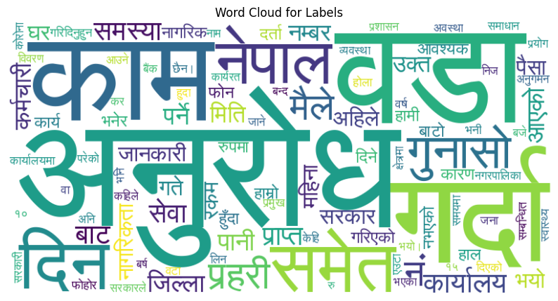

## Data
 
## Model Results
#### LSTM:
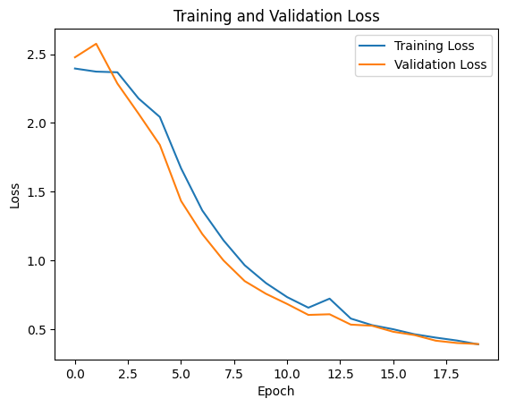

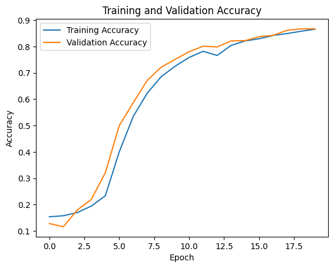
#### Nepbert :
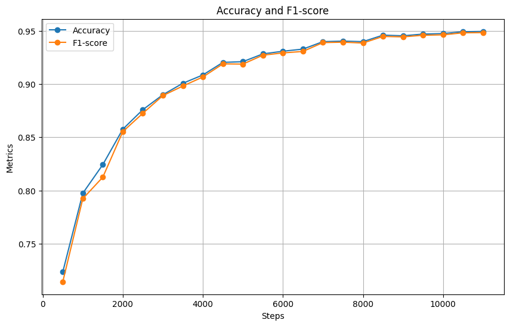
#### Bi-LSTM:
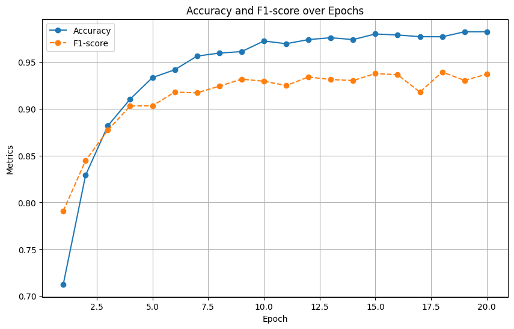
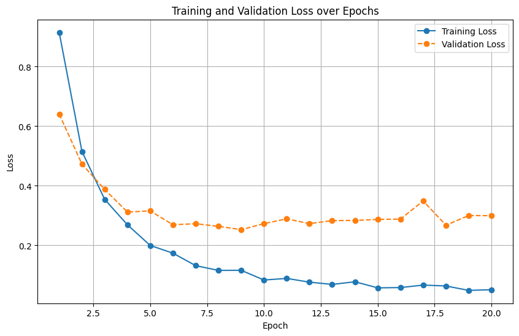
#### Muril:
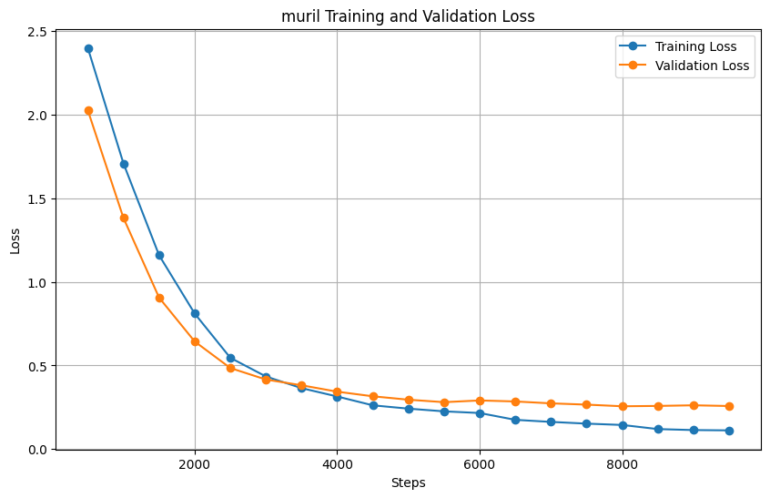

## Continual learning
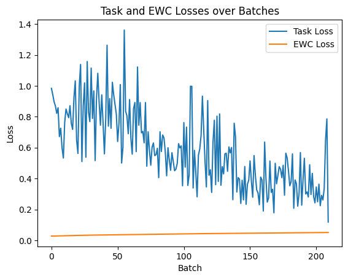

## Applications 
Telecommunication :
 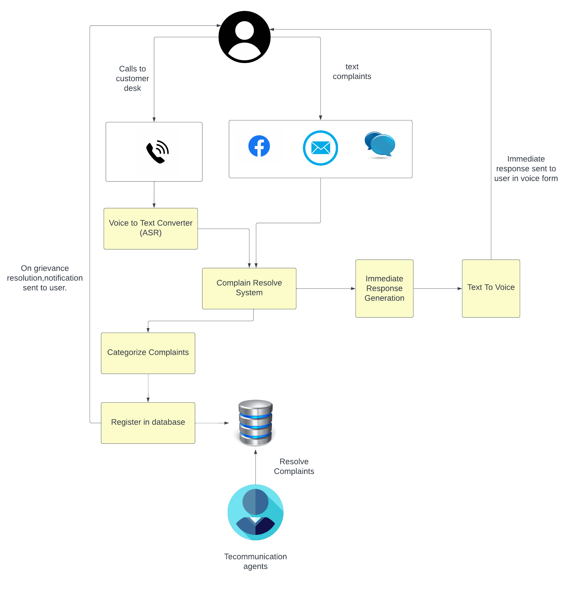
